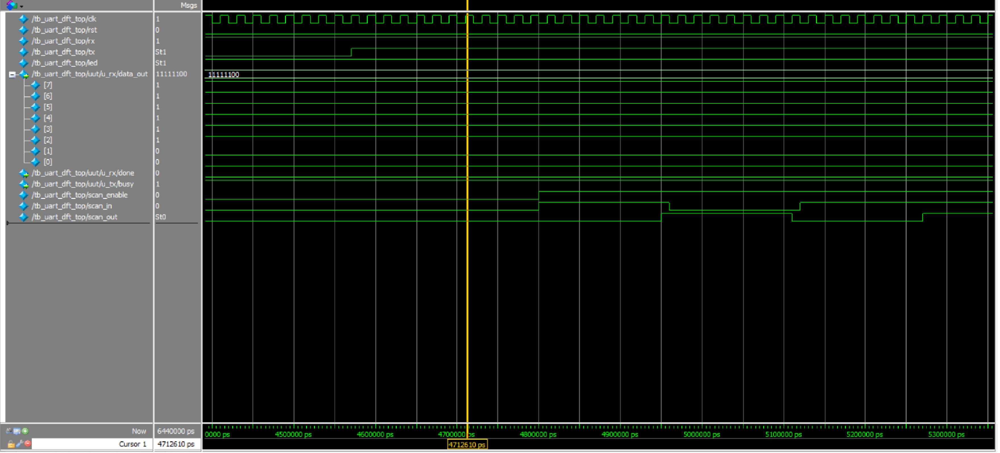
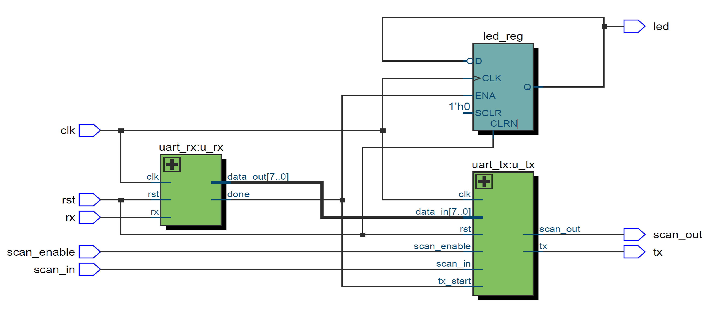

# UART DFT Demo

本專案為 UART 設計與 DFT (Design for Test) 插入練習，使用 Verilog 完成 RTL 設計，並搭配 ModelSim 進行模擬驗證。

## 📦 專案檔案
| 類型        | 檔名                  | 說明                          |
|-------------|-----------------------|-------------------------------|
| RTL Design  | `uart_dft_top.v`      | 頂層模組，整合 RX/TX 與 DFT  |
|             | `uart_rx.v`           | UART 接收器                  |
|             | `uart_tx.v`           | UART 傳送器，含 scan chain  |
|             | `command_decoder.v`   | 指令解碼器（解析接收資料）   |
|             | `cdc_sync.v`          | clock domain 同步模組       |
|             | `fifo.v`              | 簡易 FIFO 模組（如有需要）  |
|             | `uart_command_top.v`  | 前一版本設計，可參考比較    |
| Testbench   | `tb_uart_dft_top.v`   | 測試主模組行為與DFT功能      |
| 圖示        | `RTL_uart_dft_top.png`| RTL 架構總覽                 |
|             | `wave_tb_uart_dft_top.png` | 模擬波形圖展示         |

## 🔁 功能說明
- 支援 UART RX 接收資料
- UART TX 傳送資料，加入 scan_enable 控制
- 利用 LED 模擬資料接收狀態
- 實作簡單 scan chain 結構作為 DFT 插入練習

## 🧪 波形圖展示

| LED 根據接收到資料進行翻轉 |
|-----------------------------|
|  |

## 🏗️ RTL 結構圖

| RTL Block Diagram |
|-------------------|
|  |

## 📌 備註
此專案為練習用設計，重點在 RTL 撰寫與模擬驗證，不包含實體 scan chain scan pattern 產生器。

